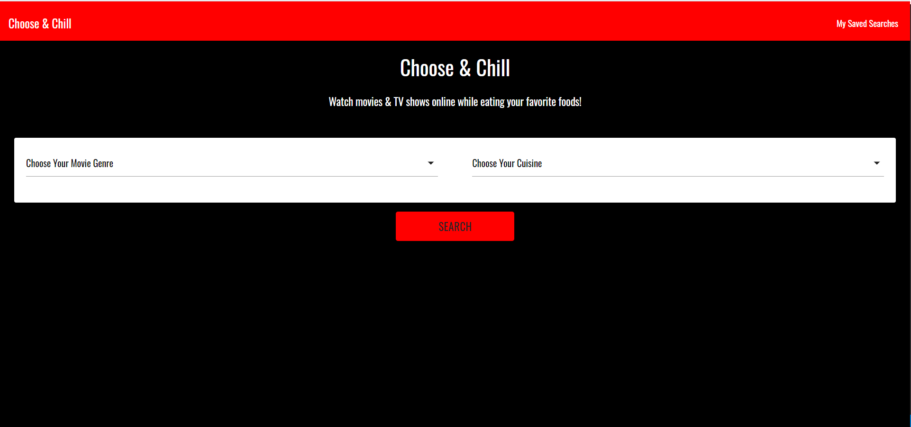

# choose-and-chill
## Description
If you are looking for ideas to create a fun night at home, Choose and Chill app is your tool. This application is a recommendation engine that helps customers plan an evening with recipe ideas as well as movie suggestions.

We used the spoonacular API to retrieve the data object for the food suggestions and the uNOGs API to retrieve the data object for the movie suggestions.

The page will display the information in this format:
- Five options for recipes, based on user's cuisine preference.
- Five options of movies based on the user's genre preference.

Each result will display a summary with pictures and will have an option to view the detailed information in a modal window. This step will also allow the user to save their preferred options in local storage for later retrieval.

 ## Languages
 JavaScript with HTML,CSS, Materialize.

 ## link
 The page can be found at:
<a href="https://martha121.github.io/choose-and-chill/"> Choose and Chill</a>

# Screenshot
Screenshot of main page:

Screenshot of User's options:

Screenshot of food results:

Screenshot of movie results:

Screenshot of food modal:

Screenshot of movie modal:

Screenshot of saved selections:

 
 

 